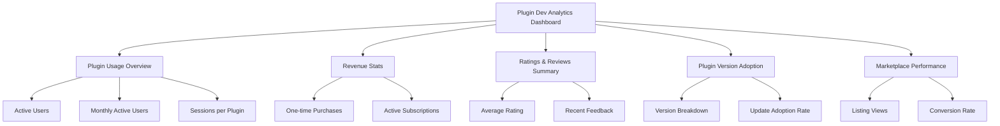

# PajamasWeb AI Hub — Admin Dashboard + Logs & Monitoring + Plugin Dev Analytics Wireframes

---

## 👨‍📈 Admin Dashboard Wireframe

```mermaid
graph TD
  A[Admin Dashboard Home]
  A --> B[System Health Overview]
  B --> B1[API Gateway Status]
  B --> B2[Memory Steward Status]
  B --> B3[Disk Space Usage]

  A --> C[Recent Activity Summary]
  C --> C1[Marketplace Transactions]
  C --> C2[Plugin Install Logs]

  A --> D[Pending Plugin Submissions]
  D --> D1[Awaiting Manual Review]

  A --> E[Team License Management (Link)]
  A --> F[System Notifications]
  F --> F1[Errors]
  F --> F2[Warnings]
  F --> F3[Info]

  A --> G[Quick Actions]
  G --> G1[Run Optimization]
  G --> G2[Manage Licenses]
  G --> G3[System Settings]
```

---

## 💡 Logs & System Monitoring UI Wireframe

```mermaid
graph TD
  A[Logs & Monitoring Panel]
  A --> B[Live System Logs]
  B --> B1[Filter by Severity]
  B --> B2[Filter by Service]
  B --> B3[Search Log Entries]

  A --> C[Historical Logs]
  C --> C1[Date Range Filter]
  C --> C2[Export Logs (JSON/CSV)]

  A --> D[System Metrics]
  D --> D1[CPU Usage]
  D --> D2[Memory Usage]
  D --> D3[Disk IO]
  D --> D4[API Latency]

  A --> E[Error Tracking]
  E --> E1[Recent Errors]
  E --> E2[Error Trends]
  E --> E3[Error Details]
```

---

## 🎯 Plugin Developer Analytics Dashboard Wireframe



---

## 🌟 Summary

This doc contains:

- **Admin Dashboard Wireframe**
- **Logs & System Monitoring UI Wireframe**
- **Plugin Developer Analytics Dashboard Wireframe**

You can:

- Include these in v1.2 / v1.3 roadmap
- Hand to backend + frontend devs
- Finalize your Admin section spec

---
