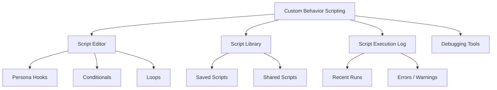
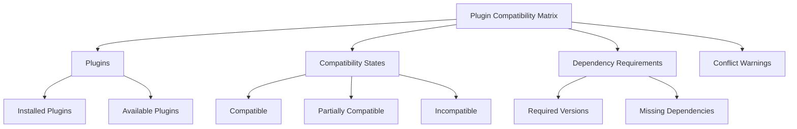
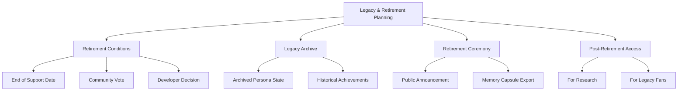

# PajamasWeb AI Hub — Behavior Scripting + Plugin Compatibility + Legacy Planning Wireframes

---

## 🔧 Persona Custom Behavior Scripting Wireframe

---

## 🌐 Persona Plugin Compatibility Matrix Wireframe

---

## 🌟 Persona Legacy & Retirement Planning Wireframe

---

## 🌟 Summary

This doc contains:

- **Persona Custom Behavior Scripting wireframe**
- **Persona Plugin Compatibility Matrix wireframe**
- **Persona Legacy & Retirement Planning wireframe**

You can:

- Enable flexible behavior customization
- Provide clear compatibility & conflict management
- Support graceful Persona lifecycle transitions

---
