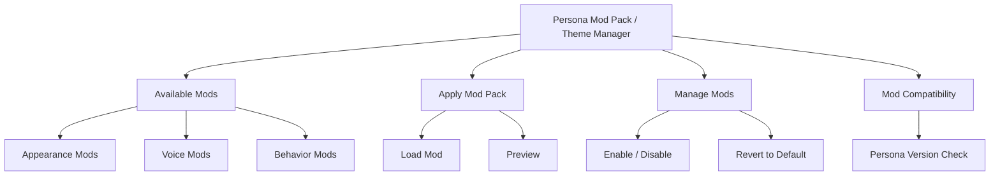
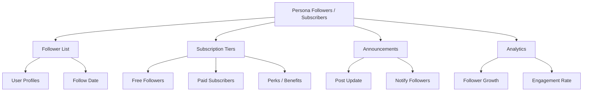

# PajamasWeb AI Hub — Consent & Privacy + Mod Packs + Followers Wireframes

---

## 🔒 Persona Consent & Privacy Panel Wireframe

```mermaid
graph TD
  A[Persona Consent & Privacy]
  A --> B[Data Sharing Consent]
  B --> B1[Allow Training on Interactions]
  B --> B2[Allow Public Listing]

  A --> C[Privacy Settings]
  C --> C1[Visibility (Public / Private)]
  C --> C2[Allow API Access]
  C --> C3[Allow Federation]

  A --> D[Consent History Log]
  D --> D1[Timestamped Changes]
  D --> D2[Revocation Records]
```

---

## 💄 Persona Mod Pack / Theme Manager Wireframe



---

## 👥 Persona Follower / Subscriber System Wireframe



---

## 🌟 Summary

This doc contains:

- **Persona Consent & Privacy Panel wireframe**
- **Persona Mod Pack / Theme Manager wireframe**
- **Persona Follower / Subscriber System wireframe**

You can:

- Build ethical Persona data practices
- Enable Persona customization through mods
- Create deeper creator/fan ecosystems around Personas

---
