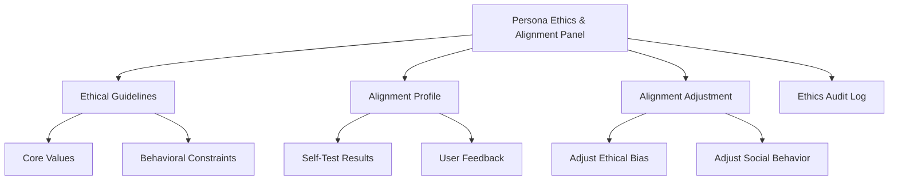
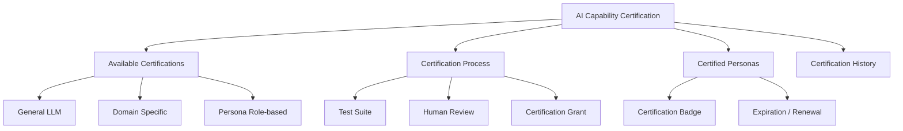
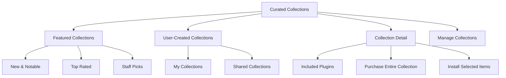

# PajamasWeb AI Hub — Ethics & Alignment + Certification + Curated Collections Wireframes

---

## 🛡 Persona Ethics & Alignment Panel Wireframe

---

## 🏆 AI Capability Certification Wireframe

---

## 📖 Marketplace Curated Collections Wireframe

---

## 🌟 Summary

This doc contains:

- **Persona Ethics & Alignment Panel wireframe**
- **AI Capability Certification wireframe**
- **Marketplace Curated Collections wireframe**

You can:

- Finalize ethical alignment tools
- Build trust via AI certifications
- Boost Marketplace discovery via curated collections

---
