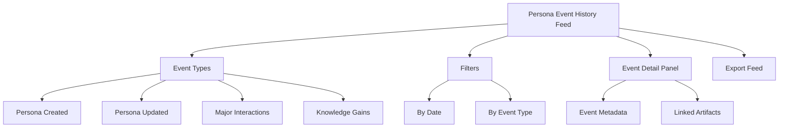
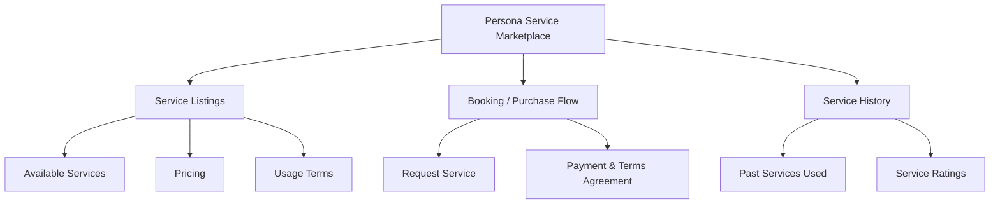
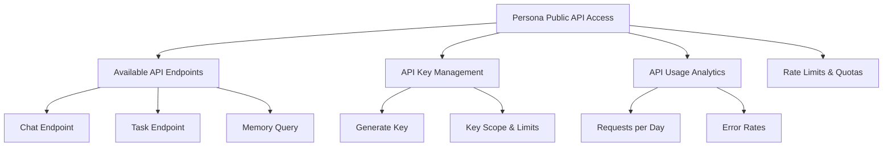

# PajamasWeb AI Hub — Event History + Service Marketplace + Public API Wireframes

---

## 🗲 Persona Event History Feed Wireframe

---

## 💼 Persona Service Marketplace Wireframe

---

## 🔜 Persona Public API Access Panel Wireframe

---

## 🌟 Summary

This doc contains:

- **Persona Event History Feed wireframe**
- **Persona Service Marketplace wireframe**
- **Persona Public API Access Panel wireframe**

You can:

- Surface transparency into Persona evolution
- Enable Personas as service providers
- Open Personas to external integrations

---
