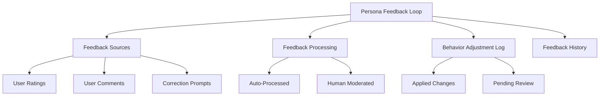
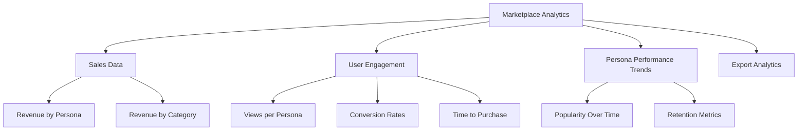

# PajamasWeb AI Hub — Feedback Loop + Marketplace Analytics + Cloning & Forking Wireframes

---

## 🌟 Persona Feedback Loop Panel Wireframe



---

## 📊 Persona Marketplace Analytics Wireframe



---

## 🤖 Persona Cloning & Forking Wireframe

```mermaid
graph TD
  A[Persona Cloning & Forking]
  A --> B[Clone Persona]
  B --> B1[Full Clone]
  B --> B2[Partial Clone (Settings / Skills Only)]

  A --> C[Fork Persona]
  C --> C1[Editable Fork]
  C --> C2[Independent from Original]

  A --> D[Lineage Tracking]
  D --> D1[Origin Persona]
  D --> D2[Change Log]

  A --> E[Public Fork Visibility]
  E --> E1[Public / Private Toggle]
  E --> E2[License Inheritance]
```

---

## 🌟 Summary

This doc contains:

- **Persona Feedback Loop Panel wireframe**
- **Persona Marketplace Analytics wireframe**
- **Persona Cloning & Forking wireframe**

You can:

- Enable dynamic Persona improvement via user feedback
- Provide rich analytics to Persona creators
- Support forking / cloning to evolve Persona ecosystem

---
