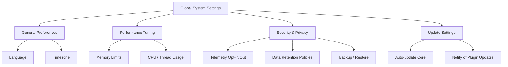
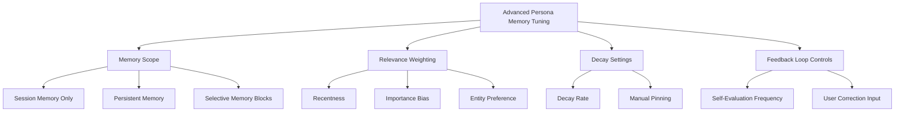
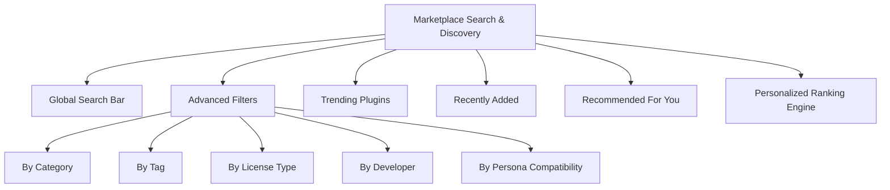

# PajamasWeb AI Hub — Global Settings + Memory Tuning + Marketplace Search Wireframes

---

## 🌐 Global System Settings Wireframe

---

## 🌟 Advanced Persona Memory Tuning Wireframe

---

## 🔍 Marketplace Search & Discovery UX Wireframe

---

## 🌟 Summary

This doc contains:

- **Global System Settings wireframe**
- **Advanced Persona Memory Tuning wireframe**
- **Marketplace Search & Discovery UX wireframe**

You can:

- Use to complete Settings & Marketplace specs
- Enable full personalization of Persona behavior
- Optimize search UX for Marketplace growth

---

If you want next, I can provide:
