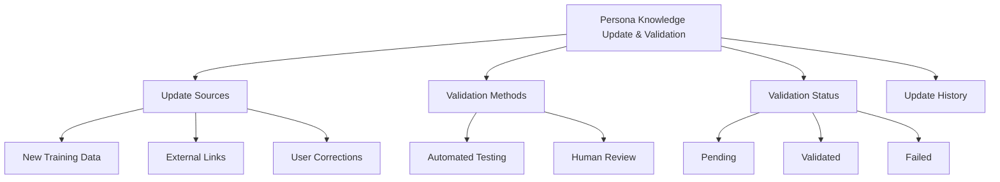
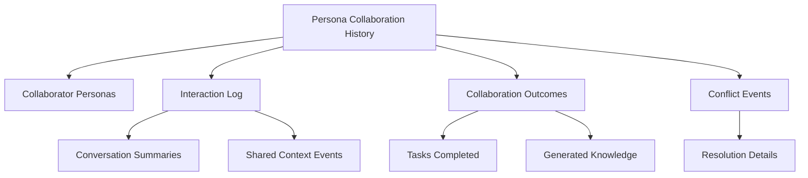
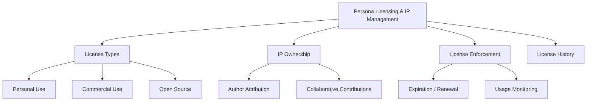

# PajamasWeb AI Hub — Knowledge Update + Collab History + IP Management Wireframes

---

## 🔄 Persona Knowledge Update & Validation Wireframe

---

## 📅 Persona Collaboration History Log Wireframe

---

## 💼 Persona Licensing & IP Management Panel Wireframe

---

## 🌟 Summary

This doc contains:

- **Persona Knowledge Update & Validation wireframe**
- **Persona Collaboration History Log wireframe**
- **Persona Licensing & IP Management Panel wireframe**

You can:

- Build trustworthy Persona update flows
- Document all AI collaborations transparently
- Provide clean licensing/IP management for Persona marketplace

---

If you want next, I can provide:
