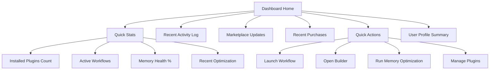

# PajamasWeb AI Hub — Memory Explorer + Dashboard Home Wireframes

---

## 🧰 Memory Explorer Wireframe (Graph Visualization)

```mermaid
graph TD
  A[Memory Explorer]
  A --> B[Entity Nodes]
  A --> C[Event Nodes]
  A --> D[Task Nodes]
  A --> E[Relations (Edges)]

  B --> F[Person Entities]
  B --> G[Concept Entities]
  B --> H[Tool/Instrument Entities]

  E --> I[relation_type: caused_by]
  E --> J[relation_type: used_by]
  E --> K[relation_type: associated_with]

  A --> L[Timeline Filter]
  A --> M[Search Box]
  A --> N[Filter by Entity Type]
  A --> O[Cluster View Toggle]
```

---

## 📅 Dashboard Home Wireframe



---

## 🌟 Summary

This doc contains:

- **Memory Explorer Wireframe** (graph visualization tab)
- **Dashboard Home Wireframe**

You can:

- Hand these to designers to start UI mockups
- Use Mermaid to export PNG/SVG for your design kit
- Integrate with previous Parts 1 & 2 wireframes

---

If you want next, I can provide:
