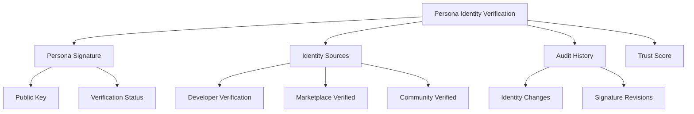
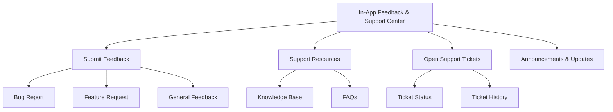
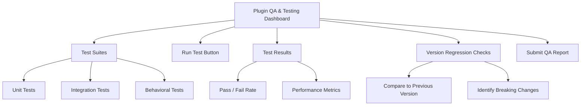

# PajamasWeb AI Hub — Persona Identity + Feedback Center + QA Dashboard Wireframes

---

## 🔑 Persona Identity & Signature Verification Wireframe

---

## 📩 In-App Feedback & Support Center Wireframe

---

## 🌟 Plugin QA & Testing Dashboard Wireframe

---

## 🌟 Summary

This doc contains:

- **Persona Identity & Signature Verification wireframe**
- **In-App Feedback & Support Center wireframe**
- **Plugin QA & Testing Dashboard wireframe**

You can:

- Further enhance trust and transparency in Persona ecosystem
- Build support channels directly into PajamasWeb Hub
- Improve plugin quality control with integrated QA tools

---
