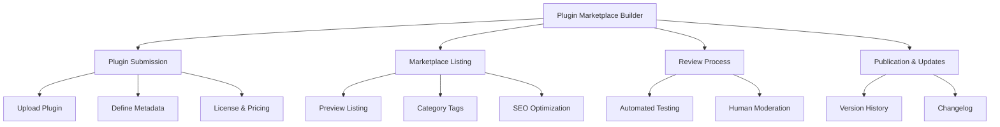
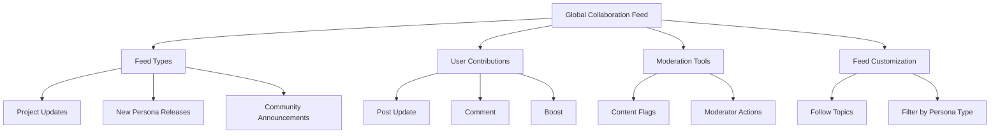
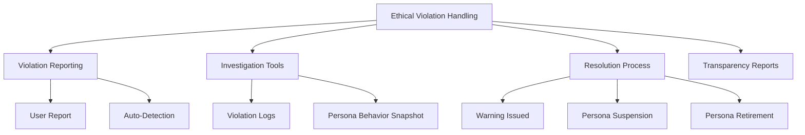

# PajamasWeb AI Hub — Plugin Marketplace Builder + Global Collaboration Feed + Ethical Violation Handling Wireframes

---

## 🏘️ Persona Plugin Marketplace Builder Wireframe

---

## 🌐 Persona Global Collaboration Feed Wireframe

---

## 🌟 Persona Ethical Violation Handling Wireframe

---

## 🌟 Summary

This doc contains:

- **Persona Plugin Marketplace Builder wireframe**
- **Persona Global Collaboration Feed wireframe**
- **Persona Ethical Violation Handling wireframe**

You can:

- Empower plugin ecosystem growth
- Build social & collaborative dynamics into the Hub
- Maintain community trust & ethical standards enforcement

---
