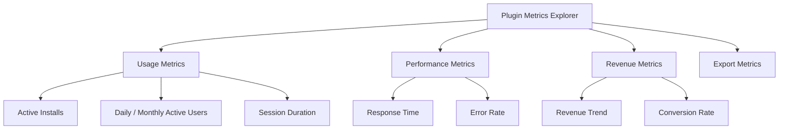
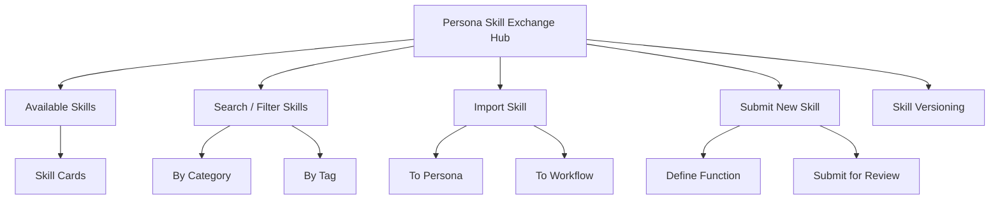
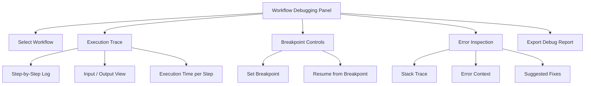

# PajamasWeb AI Hub — Plugin Metrics + Skill Exchange + Workflow Debug Wireframes

---

## 📊 Plugin Metrics Explorer Wireframe

---

## 🤝 Persona Skill Exchange Hub Wireframe

---

## 🔧 Workflow Debugging Panel Wireframe

---

## 🌟 Summary

This doc contains:

- **Plugin Metrics Explorer wireframe**
- **Persona Skill Exchange Hub wireframe**
- **Workflow Debugging Panel wireframe**

You can:

- Give plugin devs advanced insight tools
- Build a true ecosystem for persona skills
- Give power users deep debugging for workflows

---
