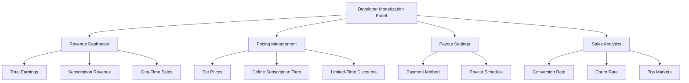
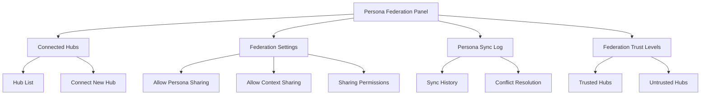
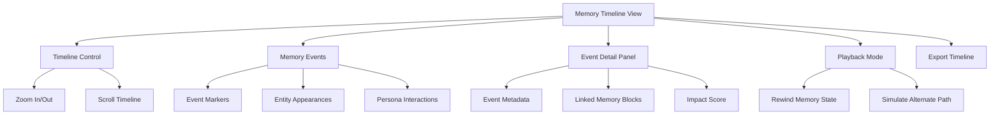

# PajamasWeb AI Hub — Monetization Tools + Federation + Memory Timeline Wireframes

---

## 💸 Plugin Developer Monetization Tools Wireframe

---

## 🤝 Persona Federation / Cross-Hub Sharing Wireframe

---

## 🕰 Advanced Memory Visualization Timeline Wireframe

---

## 🌟 Summary

This doc contains:

- **Plugin Developer Monetization Tools wireframe**
- **Persona Federation / Cross-Hub Sharing wireframe**
- **Advanced Memory Visualization Timeline wireframe**

You can:

- Finalize marketplace monetization tools
- Enable federated Persona networks
- Provide deep Memory navigation & simulation tools

---
