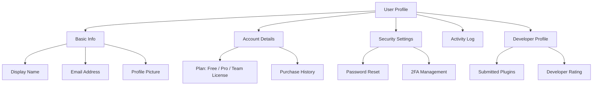
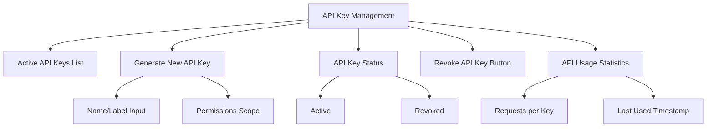
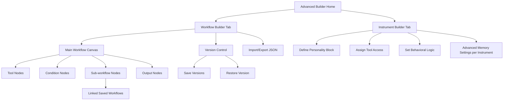

# PajamasWeb AI Hub — User Profile + API Key Mgmt + Advanced Builder Wireframes

---

## 👤 User Profile UI Wireframe

---

## 🔑 API Key Management UI Wireframe

---

## 🌐 Advanced Builder UI (Workflows + Nested Workflows)

---

## 🌟 Summary

This doc contains:

- **User Profile UI wireframe**
- **API Key Management UI wireframe**
- **Advanced Builder UI wireframe (nested workflows, versioning)**

You can:

- Add to v1.2 Builder feature set
- Include User Profile & API for Dev Portal / Pro Users
- Feed directly to frontend for implementation

---
