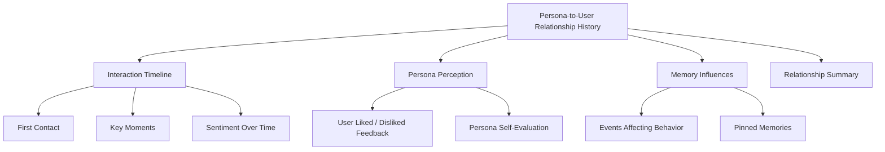
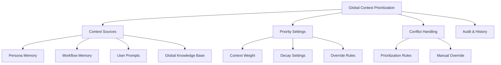
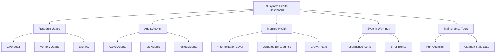

# PajamasWeb AI Hub — Relationship History + Context Prioritization + System Health Wireframes

---

## 👥 Persona-to-User Relationship History Wireframe

---

## 🔄 Global Context Prioritization Wireframe

---

## 📊 AI System Health Dashboard Wireframe

---

## 🌟 Summary

This doc contains:

- **Persona-to-User Relationship History wireframe**
- **Global Context Prioritization wireframe**
- **AI System Health Dashboard wireframe**

You can:

- Deepen persona-human transparency
- Enable fine-tuned context management
- Provide full AI system operational visibility

---
