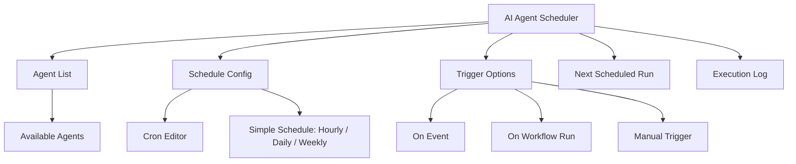
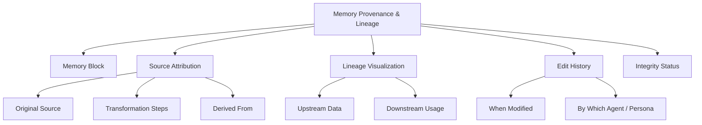
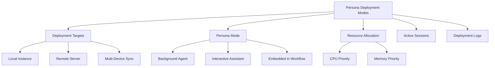

# PajamasWeb AI Hub — Agent Scheduler + Memory Provenance + Persona Deployment Wireframes

---

## 📅 AI Agent Scheduler UI Wireframe

---

## 🌟 Memory Provenance & Lineage UI Wireframe

---

## 🤖 Persona Deployment Modes UI Wireframe

---

## 🌟 Summary

This doc contains:

- **AI Agent Scheduler UI wireframe**
- **Memory Provenance & Lineage UI wireframe**
- **Persona Deployment Modes UI wireframe**

You can:

- Finalize advanced AI Ops features for PajamasWeb Hub
- Build transparency + trust for AI memory handling
- Enable flexible Persona deployment strategies

---
