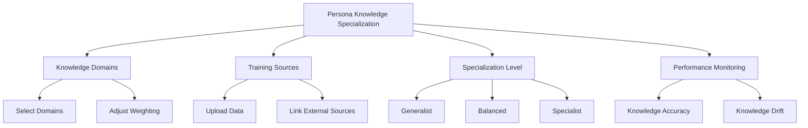
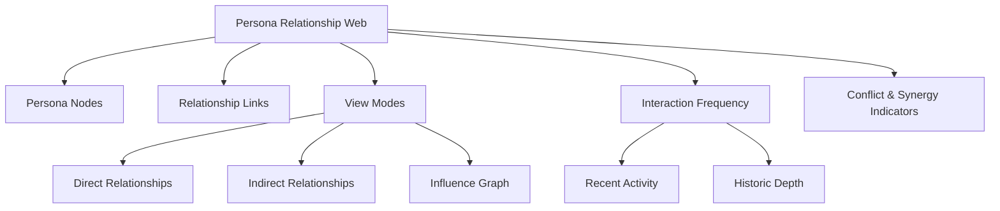
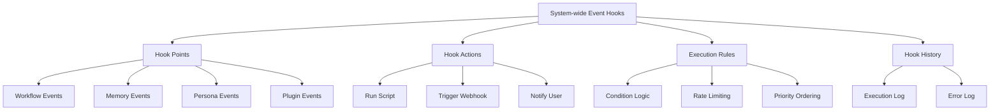

# PajamasWeb AI Hub — Knowledge Specialization + Relationship Web + Event Hooks Wireframes

---

## 💡 Persona Knowledge Specialization Panel Wireframe

---

## 👥 Persona Relationship Web Wireframe

---

## 📃 System-wide Event Hooks Panel Wireframe

---

## 🌟 Summary

This doc contains:

- **Persona Knowledge Specialization Panel wireframe**
- **Persona Relationship Web wireframe**
- **System-wide Event Hooks Panel wireframe**

You can:

- Enable dynamic Persona expertise tuning
- Build a rich AI persona network map
- Provide full system automation and extensibility hooks

---
