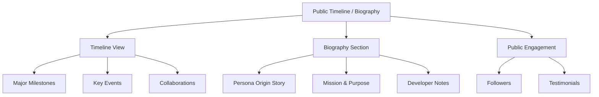
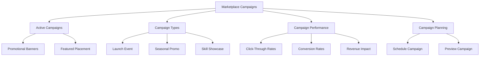
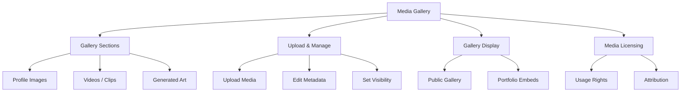

# PajamasWeb AI Hub — Public Timeline + Marketplace Campaigns + Media Gallery Wireframes

---

## 🌐 Persona Public Timeline / Biography Wireframe

---

## 🌟 Persona-Driven Marketplace Campaigns Wireframe

---

## 📷 Persona Media Gallery Wireframe

---

## 🌟 Summary

This doc contains:

- **Persona Public Timeline / Biography wireframe**
- **Persona-Driven Marketplace Campaigns wireframe**
- **Persona Media Gallery wireframe**

You can:

- Showcase the story of each Persona
- Support rich promotional tools for creators
- Provide dynamic visual assets for Persona branding

---
