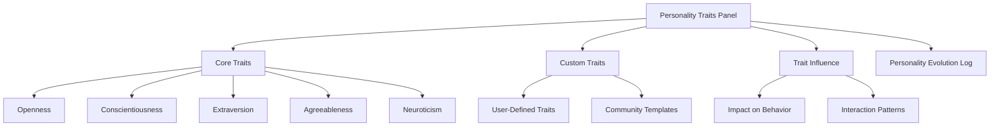
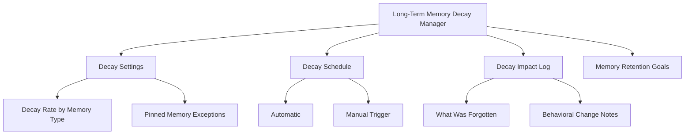
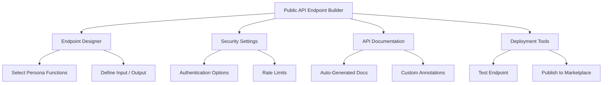

# PajamasWeb AI Hub — Personality Traits + Memory Decay + API Endpoint Builder Wireframes

---

## 💡 Persona Personality Traits Panel Wireframe

---

## 🔄 Persona Long-Term Memory Decay Manager Wireframe

---

## 🔜 Persona Public API Endpoint Builder Wireframe

---

## 🌟 Summary

This doc contains:

- **Persona Personality Traits Panel wireframe**
- **Persona Long-Term Memory Decay Manager wireframe**
- **Persona Public API Endpoint Builder wireframe**

You can:

- Provide transparent personality modeling
- Control memory dynamics over long-term Persona life
- Allow creators to easily publish Persona APIs

---
