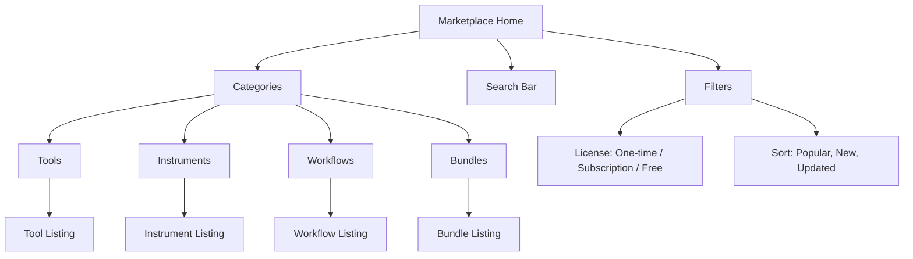
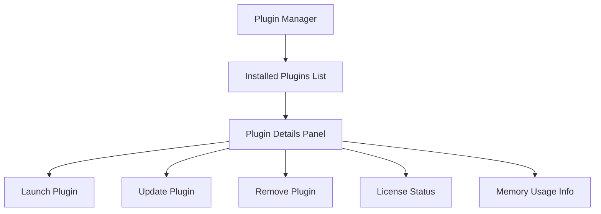
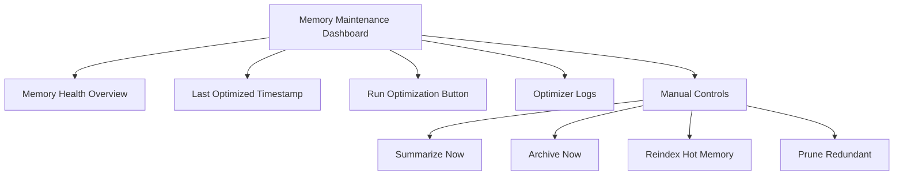

# PajamasWeb AI Hub — Wireframes (Markdown + Mermaid)

---

## 🌐 Marketplace Wireframe



---

## 🔌 Plugin Manager Wireframe



---

## 📈 Builder UI — Workflows & Instruments

```mermaid
graph TD
  A[Builder Main]
  A --> B[Workflow Builder]
  A --> C[Instrument Builder]
  B --> D[Canvas (Drag & Drop)]
  D --> E[Add Tool]
  D --> F[Add Condition]
  D --> G[Set Output]
  D --> H[Save Workflow]
  C --> I[Define Personality]
  C --> J[Assign Tools]
  C --> K[Configure Behavior]
  C --> L[Save Instrument]
```

---

## 📊 Memory Maintenance Tab



---

## 🌟 Summary

These Mermaid diagrams serve as the first wireframe spec for:

- Marketplace
- Plugin Manager
- Builder (Workflows + Instruments)
- Memory Maintenance

💡 You can:

- Copy them into GitHub Markdown
- Render them in VSCode + Mermaid plugins
- Export SVG/PNG for visual use
- Hand to designers/devs as the starting structure

---
