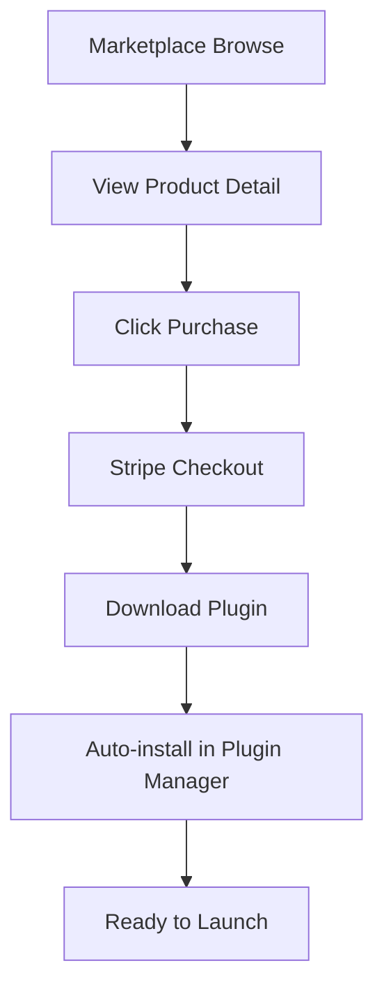
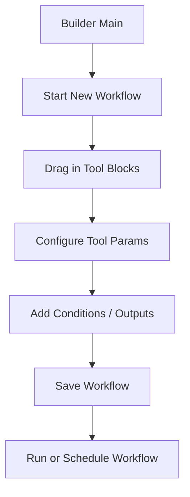
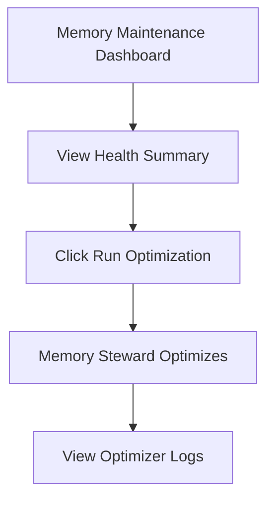
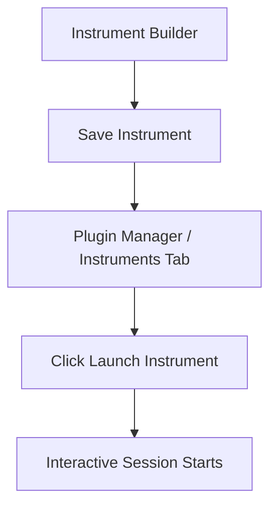

# PajamasWeb AI Hub — Wireframes Part 2 (Components + User Flows)

---

## 🛠️ UI Component List

### Global Components

- Top Navigation Bar
- Sidebar (Collapsible)
- User Profile Menu
- Notifications / Alerts
- Modal Dialogs
- Search Bar
- Filter Panel
- Pagination Controls

### Marketplace Components

- Category Card
- Product Tile (Tool / Instrument / Workflow)
- Product Detail Page
- Purchase Button
- Subscription Toggle
- License Status Badge

### Plugin Manager Components

- Plugin List Item
- Plugin Detail Panel
- Launch Button
- Update Button
- Remove Button
- License Info Section
- Memory Usage Display

### Builder Components

- Builder Toolbar (New, Save, Export)
- Drag & Drop Canvas
- Node: Tool Block
- Node: Condition Block
- Node: Output Block
- Node: Personality Block
- Connection Line (Between Nodes)
- Inspector Panel (Edit Block Settings)

### Memory Maintenance Components

- Memory Health Card
- Last Optimized Timestamp
- Run Optimization Button
- Optimizer Logs Table
- Manual Control Buttons:
  - Summarize Now
  - Archive Now
  - Reindex
  - Prune Redundant

---

## 📐 User Flow Diagrams

### Purchase and Install Plugin

---

### Build and Save Workflow

---

### Run Memory Optimization

---

### Launch Instrument

---

## 🌟 Summary

This Part 2 wireframe spec includes:

- Full UI Component List
- Core User Flow Diagrams (Markdown + Mermaid)

You can:

- Version these in GitHub
- Render Mermaid diagrams in VSCode
- Export SVG/PNG for visual spec use
- Hand to devs + designers for immediate UI prototyping

---

**Next available additions:**
